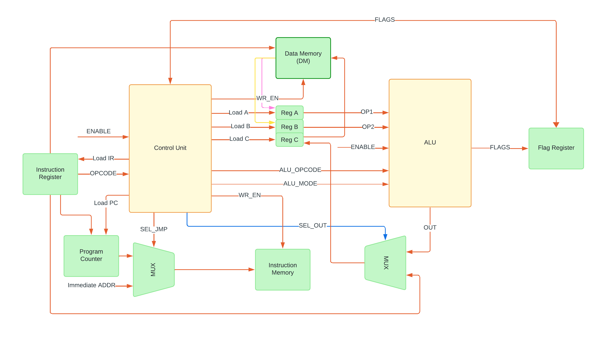

# 19-bit-cpu-dv
Design and verification of a 19-bit CPU architecture in SystemVerilog.

The 19-bit CPU has 19-bit instructions and a 19-bit word. Memories are modeled as 19-bit word-addressable.
This project was taken up as a challenge and refresher for CPU architecture concepts beyond the standard power-of-two memory and compute architectures.

---

## **Design**
The CPU is designed for a **Harvard architecture** with separate instruction and data memories and buses.  
Signals are separated into buses:
- **Control Bus** → Manages execution control signals
- **Data Bus** → Transfers operand and result data
- **Instruction Bus** → Transfers instructions
- **Address Buses** → Determines memory locations, separate for instructions and data

Since using standard 8-bit-byte- and 16-bit-word-addressable memories would waste space for 19-bit words, the memories modeled are 19-bit-word addressable. The control unit is pipelined with an RDFE state machine: Reset, Decode, Fetch, Execute.

---

## **Instruction Set (Supported Opcodes)**
The CPU shall support the following instructions:

### **Logical Operations**
| Instruction | Opcode  | Description |
|------------|---------|-------------|
| `NOT`      | `00000` | Bitwise NOT |
| `AND`      | `00001` | Bitwise AND |
| `OR`       | `00010` | Bitwise OR  |
| `XOR`      | `00011` | Bitwise XOR |

### **Arithmetic Operations**
| Instruction | Opcode  | Description |
|------------|---------|-------------|
| `ADD`      | `00100` | Addition    |
| `SUB`      | `00101` | Subtraction |
| `MUL`      | `00110` | Multiplication |
| `DIV`      | `00111` | Division    |
| `INC`      | `01000` | Increment   |
| `DEC`      | `01001` | Decrement   |

### **Control Flow Instructions**
| Instruction | Opcode  | Description |
|------------|---------|-------------|
| `JMP`      | `01100` | Unconditional Jump |
| `BEQ`      | `01101` | Branch if Equal   |
| `BNE`      | `01110` | Branch if Not Equal |
| `CALL`     | `01111` | Function Call |
| `RET`      | `10000` | Return from Function |

### **Memory Access Instructions**
| Instruction | Opcode  | Description |
|------------|---------|-------------|
| `LD`       | `10001` | Load from Memory |
| `ST`       | `10010` | Store to Memory  |

---

## **Verification**

The verification environment (under development) shall consist of:
- **Drivers** → Apply stimulus to DUT  
- **Monitors** → Observe DUT behavior  
- **Generators** → Generate test transactions (random/constrained)  
- **Scoreboards** → Compare DUT output with expected results  
- **Testcases** → Execute different verification scenarios  
